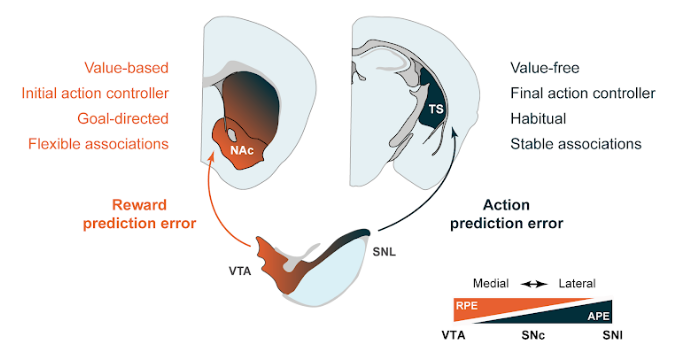
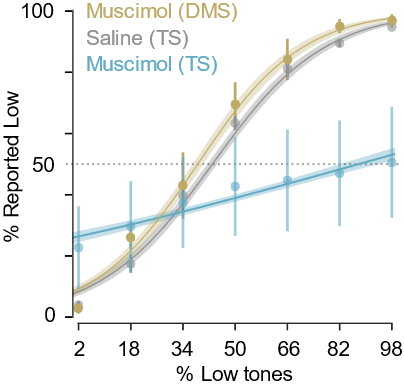
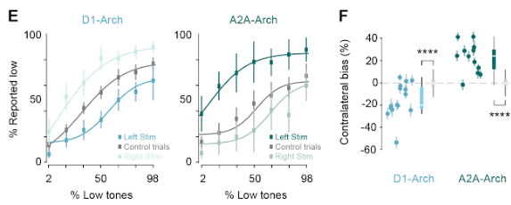
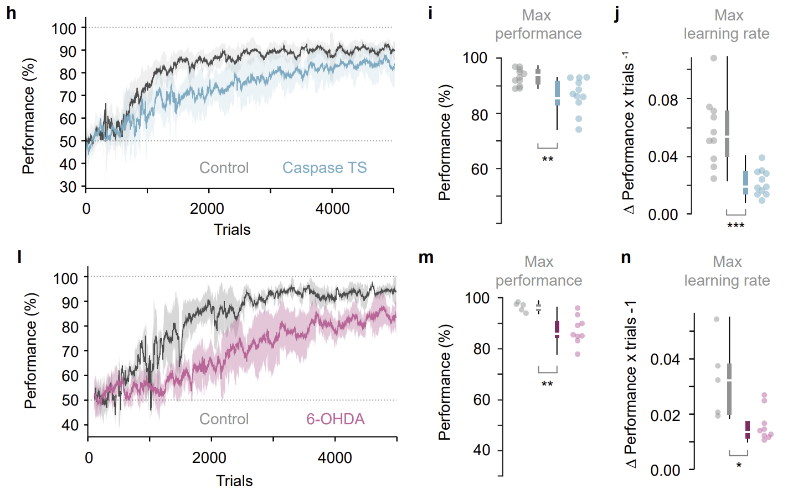
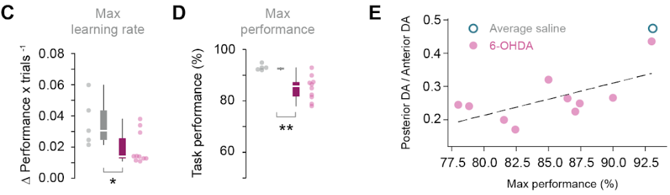
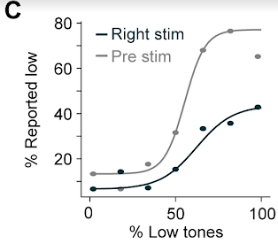
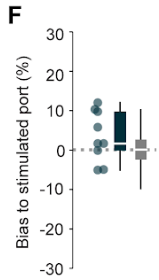
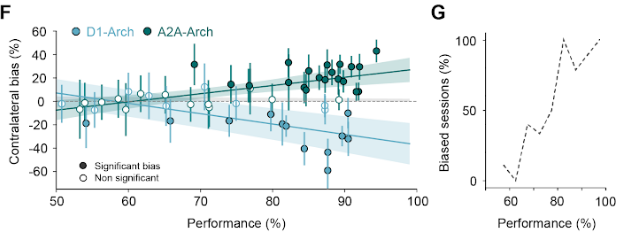
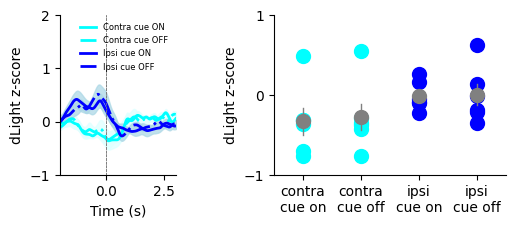
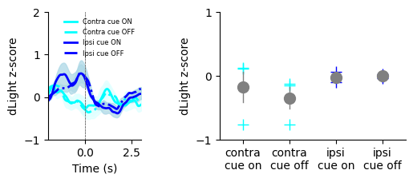

Code: [](https://doi.org/10.5281/zenodo.10732202)

Datasets: [](https://doi.org/10.5281/zenodo.7261639)

# APE_paper test
Reproduction of figures for the [APE paper](https://www.biorxiv.org/content/10.1101/2022.09.12.507572v1)

<p align="center">
  
</p>

Francesca Greenstreet, Hernando Vergara, Yvonne Johansson, Sthitapranjya Pati, Stephen C Lenzi, Alina Gubanova, Laura Schwarz, Matthew Wisdom, Fred Marbach, Lars Rollik, Theodore Moskovitz, Joseph Cohen, Emmett Thompson, Troy W Margrie, Claudia Clopath, Marcus Stephenson-Jones, "Action prediction error: a value-free dopaminergic teaching signal that drives stable learning." bioRxiv, 2022.


### See documentation (scripts to generate figures) [here](https://hernandomv.github.io/APE_paper/)

# To run things locally in your machine:

1. clone this repo

```
git clone https://github.com/HernandoMV/APE_paper.git
```

2. create the environment (optional). Otherwise you might need to install some dependencies manually.

    ```
    conda env create -f environment.yml
    conda activate APE_paper
    ```

3. install the tool to analyse the behavior
    ### Option 1: from PyPi
    ```
    pip install mouse-behaviour-analysis-tools
    ```

    ### Option 2: from the tools repo
    https://github.com/HernandoMV/mouse-behavior-analysis-tools

    With this option it will be easier for you to change things from the functions directly,
    such as plotting options.

    3.2.1. clone the repo

    ```
    git clone https://github.com/HernandoMV/mouse-behavior-analysis-tools.git
    ```

    3.2.2. change the current directory to that of the cloned repo

    ```
    cd mouse-behaviour-analysis-tools
    ```

    3.2.3. in the root directory of the cloned repo type

    ```
    pip install -e .
    ```

4. run the scripts in `scripts` folder, or download them in script or notebook format from the [documentation](https://hernandomv.github.io/APE_paper/)


# Run the Google Colab notebooks directly in your browser:

[Figure 1 C](https://colab.research.google.com/github/HernandoMV/APE_paper/blob/main/docs/figures_notebooks/Figure_1_C.ipynb)
<p align="left">
  
</p>

[Figure 1 EF](https://colab.research.google.com/github/HernandoMV/APE_paper/blob/main/docs/figures_notebooks/Figure_1_EF.ipynb)
<p align="left">
  
</p>

[Figure 1 IJK](https://colab.research.google.com/github/HernandoMV/APE_paper/blob/main/docs/figures_notebooks/Figure_1_IJK.ipynb)
<p align="left">
  
</p>

[Figure 2 BCDE](https://colab.research.google.com/github/HernandoMV/APE_paper/blob/main/docs/figures_notebooks/Figure_2_BCDE.ipynb)
<p align="left">
  
  
</p>

[Figure 6 CDF](https://colab.research.google.com/github/HernandoMV/APE_paper/blob/main/docs/figures_notebooks/Figure_6_CDF.ipynb)
<p align="left">
  
  
  
</p>

[Figure 7 FG](https://colab.research.google.com/github/HernandoMV/APE_paper/blob/main/docs/figures_notebooks/Figure_7_FG.ipynb)
<p align="left">
  
</p>

[ED 12 FG](https://colab.research.google.com/github/HernandoMV/APE_paper/blob/main/docs/figures_notebooks/Figure_S5_TU.ipynb)
<p align="left">
  
</p>

[ED 5 PQR](https://colab.research.google.com/github/HernandoMV/APE_paper/blob/main/docs/figures_notebooks/Figure_S5_TU.ipynb)
<p align="left">
  
</p>

[ED 5 ST](https://colab.research.google.com/github/HernandoMV/APE_paper/blob/main/docs/figures_notebooks/Figure_S5_TU.ipynb)
<p align="left">
  
  
</p>

[ED 5 VW](https://colab.research.google.com/github/HernandoMV/APE_paper/blob/main/docs/figures_notebooks/Figure_S5_TU.ipynb)
<p align="left">
  
</p>

[ED 5 XY](https://colab.research.google.com/github/HernandoMV/APE_paper/blob/main/docs/figures_notebooks/Figure_S5_TU.ipynb)
<p align="left">
  
</p>
