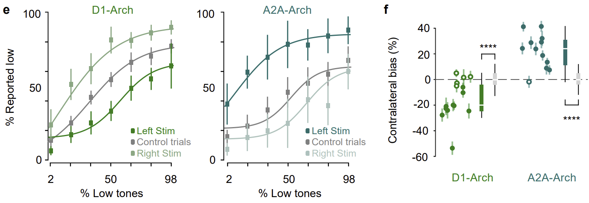

# APE_paper
Reproduction of figures for the [APE paper](https://www.biorxiv.org/content/10.1101/2022.09.12.507572v1)

<p align="center">
  
</p>

Francesca Greenstreet, Hernando Vergara, Sthitapranjya Pati, Laura Schwarz, Matthew Wisdom, Fred Marbach, Yvonne Johansson, Lars Rollik, Theodore Moskovitz, Claudia Clopath, Marcus Stephenson-Jones, "Action prediction error: a value-free dopaminergic teaching signal that drives stable learning." bioRxiv, 2022.


### See documentation [here](https://hernandomv.github.io/APE_paper/)

# Installation

1. clone this repo

2. create the environment (optional)

    ```
    conda env create -f environment.yml
    conda activate APE_paper
    ```

3. install the tool to analyse the behavior
    ### Option 1: from PyPi
    ```
    pip install mouse-behaviour-analysis-tools
    ```

    ### Option 2: from the tools repo
    https://github.com/HernandoMV/mouse-behavior-analysis-tools

    With this option it will be easier for you to change things from the functions directly,
    such as plotting options.

    3.2.1. clone the repo
    3.2.2. change the current directory to that of the cloned repo

    ```
    cd mouse-behaviour-analysis-tools
    ```

    3.2.3. in the root directory of the cloned repo type

    ```
    pip install -e .
    ```

# Colab notebooks:
[Figure 1 C](https://colab.research.google.com/github/HernandoMV/APE_paper/blob/main/docs/figures_notebooks/Figure_1_C.ipynb)
<p align="left">
  
</p>

[Figure 1 EF](https://colab.research.google.com/github/HernandoMV/APE_paper/blob/main/docs/figures_notebooks/Figure_1_EF.ipynb)
<p align="left">
  
</p>

[Figure 1 IJK](https://colab.research.google.com/github/HernandoMV/APE_paper/blob/main/docs/figures_notebooks/Figure_1_IJK.ipynb)
<p align="left">
  
</p>

[Figure 2 BCDE](https://colab.research.google.com/github/HernandoMV/APE_paper/blob/main/docs/figures_notebooks/Figure_2_BCDE.ipynb)
<p align="left">
  
  
</p>

[Figure 6 CDF](https://colab.research.google.com/github/HernandoMV/APE_paper/blob/main/docs/figures_notebooks/Figure_6_CDF.ipynb)
<p align="left">
  
  
  
</p>

[Figure 7 FG](https://colab.research.google.com/github/HernandoMV/APE_paper/blob/main/docs/figures_notebooks/Figure_7_FG.ipynb)\
<p align="left">
  
</p>

